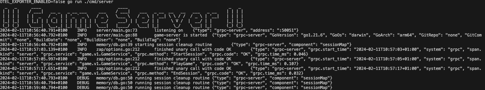
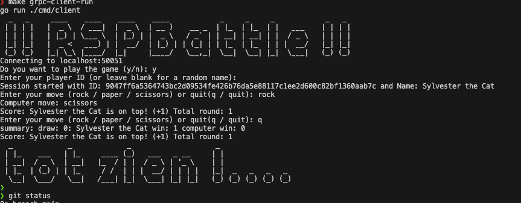

# Introduction

Rock, Paper, Scissors is a classic hand game played between two people. Each player simultaneously forms one of three shapes with an outstretched hand: rock (a closed fist), paper (an open hand), or scissors (a fist with the index and middle fingers extended). The outcome of the game is determined by the rules: rock beats scissors, scissors beats paper, and paper beats rock. It's a simple yet entertaining game that can be played anytime, anywhere.

This project is a simple implementation of the Rock, Paper, Scissors game using gRPC. The game is played against the computer, and the player can choose one of the three shapes. The computer also selects a shape, and the winner is determined based on the rules.

## bullet points

- gRPC server and client application
- otel for observability
- buf for proto management
- loose coupling
- high cohesion
- inbounds and outbounds
- error handling
- error logging at controller level
- unit tests
- makefile for easy commands

## How to Play

Frist, you need to start the server

```shell
$ make grpc-server-run
```

Then, you can play the game by running the client

```shell
$ make grpc-client-run
```

## Screenshots

### Server



### Client


